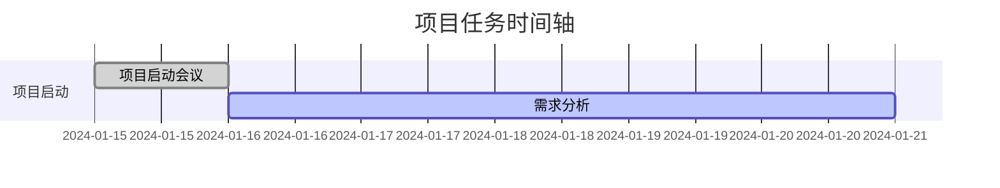
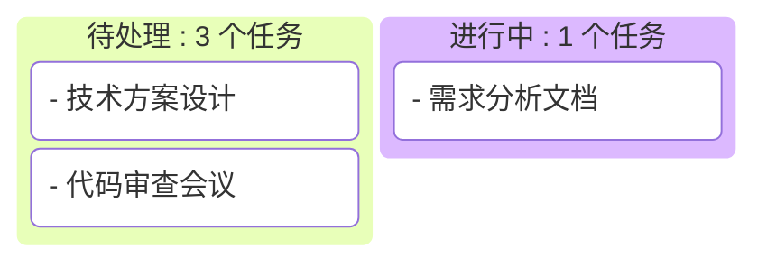

# 🚀 Mermaid 时间轴任务看板

一个基于 Mermaid.js 的动态编译时间轴任务看板系统，支持 Markdown 文件自动编译为可视化任务管理界面。

## ✨ 特性

- 📅 **Mermaid 时间轴**: 自动生成甘特图时间轴
- 📋 **任务看板**: 支持多种状态的任务管理
- 📝 **Markdown 支持**: 使用 Markdown 编写任务内容
- 🔄 **自动编译**: 文件变化时自动重新生成
- 🎨 **现代化 UI**: 响应式设计，支持移动端
- 📊 **实时统计**: 任务状态和数量统计

## 🚀 快速开始

### 1. 安装依赖

```bash
npm install
```

### 2. 创建任务文件

在 `post/` 文件夹中创建 `.md` 文件，使用以下格式：

```markdown
---
title: 任务标题
date: 2024-01-15
status: pending
priority: high
---

# 任务内容

这里是任务的详细描述，支持 Markdown 语法。

## 子标题
- 列表项 1
- 列表项 2
```

### 3. 编译生成

```bash
# 一次性编译
npm run build

# 监听文件变化，自动编译
npm run watch
```

### 4. 查看结果

编译完成后，在 `dist/` 文件夹中会生成 `index.html` 文件，直接在浏览器中打开即可查看。

## 📁 项目结构

```
web/
├── post/                    # 任务文件目录
│   ├── example-task-1.md
│   ├── example-task-2.md
│   └── ...
├── dist/                    # 输出目录
│   └── index.html          # 生成的HTML文件
├── src/                     # 源代码目录
│   ├── compiler.js          # 编译脚本
│   └── template.html        # HTML模板
├── config/                  # 配置文件目录
│   ├── timeline.md          # Mermaid时间轴配置
│   └── task.md             # Mermaid看板配置
├── package.json             # 项目配置
└── README.md               # 说明文档
```

## ⚙️ 配置选项

### 任务状态 (status)

- `pending`: 待处理 (黄色)
- `in-progress`: 进行中 (蓝色)
- `completed`: 已完成 (绿色)
- `cancelled`: 已取消 (红色)

### 优先级 (priority)

- `low`: 低 (灰色)
- `medium`: 中 (黄色)
- `high`: 高 (红色)
- `urgent`: 紧急 (红色，带闪烁效果)

### 日期格式

支持 ISO 8601 格式：`YYYY-MM-DD`

## 🎯 使用方法

### 1. 编写任务

在 `post/` 文件夹中创建新的 `.md` 文件，按照模板格式编写任务内容。

### 2. 设置元数据

在文件开头使用 YAML front-matter 设置任务属性：

```yaml
---
title: 任务标题
date: 2024-01-15
status: in-progress
priority: high
---
```

### 3. 编写内容

在元数据下方使用 Markdown 语法编写任务详细内容。

### 4. 配置Mermaid图表

- **时间轴配置**: 编辑 `config/timeline.md` 文件中的Mermaid甘特图代码
- **看板配置**: 编辑 `config/task.md` 文件中的Mermaid看板代码

### 5. 自动编译

运行 `npm run watch` 命令，系统会自动监听文件变化并重新编译。

## 🔧 自定义配置

### 修改编译选项

编辑 `compiler.js` 文件中的配置：

```javascript
constructor() {
    this.postsDir = './post';        // 任务文件目录
    this.outputDir = './dist';       // 输出目录
    this.templatePath = './src/template.html';  // 模板文件
    this.timelinePath = './config/timeline.md';    // 时间轴配置文件
    this.taskPath = './config/task.md';           // 看板配置文件
    this.outputFile = 'index.html';  // 输出文件名
}
```

### Mermaid图表配置

#### 时间轴配置 (config/timeline.md)
编辑 `config/timeline.md` 文件来自定义甘特图：



#### 看板配置 (config/task.md)
编辑 `config/task.md` 文件来自定义看板：



### 自定义样式

编辑 `src/template.html` 文件中的 CSS 样式，可以自定义：

- 颜色主题
- 布局样式
- 响应式设计
- 动画效果

## 📱 部署说明

### 本地部署
1. 运行 `npm run build` 生成静态文件
2. 将 `dist/` 文件夹中的所有文件上传到你的 Web 服务器
3. 或者使用本地脚本：`./scripts/deploy.sh --preview`

### GitHub Actions 自动部署
本项目配置了完整的CI/CD流程，支持自动编译和部署：

#### 自动触发
- **Push到main分支**: 自动部署到生产环境
- **Push到develop分支**: 自动部署到staging环境  
- **创建PR**: 自动部署预览版本
- **创建标签**: 自动发布新版本

#### 手动触发
1. 进入GitHub仓库的Actions页面
2. 选择"高级自动部署"工作流
3. 点击"Run workflow"选择环境

#### 部署地址
- **生产环境**: `https://username.github.io/repo/`
- **Staging环境**: `https://username.github.io/repo/staging/`
- **PR预览**: `https://username.github.io/repo/preview/PR编号/`

详细配置说明请查看 [`.github/README.md`](.github/README.md)

## 🛠️ 技术栈

- **Node.js**: 编译脚本运行环境
- **Mermaid.js**: 图表渲染引擎
- **Marked**: Markdown 解析器
- **Front-matter**: YAML 元数据解析
- **Chokidar**: 文件监听器

## 📄 许可证

MIT License

## 🤝 贡献

欢迎提交 Issue 和 Pull Request！

## 📞 支持

如果遇到问题，请检查：

1. Node.js 版本是否兼容
2. 依赖是否正确安装
3. 文件格式是否符合要求
4. 控制台是否有错误信息

---

**享受你的任务管理之旅！** 🎉
